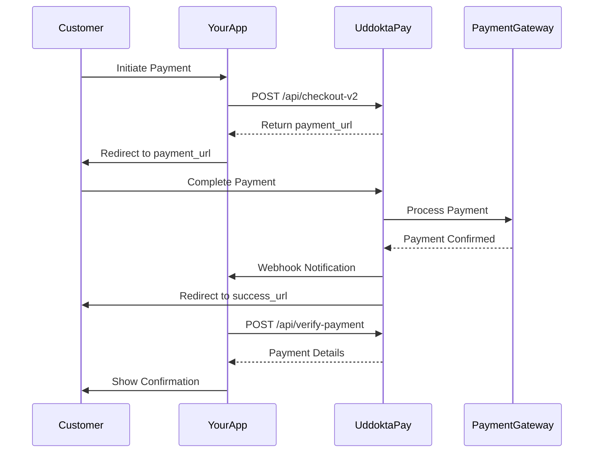

# UddoktaPay API Documentation

> **Modern AI-Friendly Documentation for Payment Integration**

## 🚀 Quick Start

UddoktaPay is a payment automation solution for Bangladesh, supporting bKash, Nagad, Rocket, Upay, and Bank transfers.

### Base URLs

```
Sandbox: https://sandbox.uddoktapay.com
Production: https://pay.your-domain.com
```

### Sandbox Credentials

```
API Key: 982d381360a69d419689740d9f2e26ce36fb7a50
```

---

## 📚 Table of Contents

1. [Authentication](#authentication)
2. [API Endpoints](#api-endpoints)
   - [Create Charge](#create-charge)
   - [Verify Payment](#verify-payment)
   - [Refund Payment](#refund-payment)
3. [Webhooks](#webhooks)
4. [Code Examples](#code-examples)
5. [Error Handling](#error-handling)

---

## 🔐 Authentication

All API requests require authentication via header:

```http
RT-UDDOKTAPAY-API-KEY: your_api_key_here
Content-Type: application/json
Accept: application/json
```

---

## 📡 API Endpoints

### Create Charge

**Endpoint:** `POST /api/checkout-v2`

Creates a payment request and returns a payment URL for the customer.

#### Request Body

```typescript
{
  full_name: string;      // Required: Customer's full name
  email: string;          // Required: Customer's email
  amount: string;         // Required: Payment amount (e.g., "100")
  metadata: object;       // Required: Custom data (user_id, order_id, etc.)
  redirect_url: string;   // Required: Success redirect URL
  return_type?: string;   // Optional: "GET" or "POST" (default: "POST")
  cancel_url: string;     // Required: Cancel redirect URL
  webhook_url?: string;   // Optional: IPN callback URL
}
```

#### Response

**Success (200 OK):**
```json
{
  "status": true,
  "message": "Payment Url",
  "payment_url": "https://sandbox.uddoktapay.com/payment/abc123..."
}
```

**Error:**
```json
{
  "status": false,
  "message": "Error description"
}
```

#### Example Request

```javascript
const response = await fetch('https://sandbox.uddoktapay.com/api/checkout-v2', {
  method: 'POST',
  headers: {
    'RT-UDDOKTAPAY-API-KEY': '982d381360a69d419689740d9f2e26ce36fb7a50',
    'Content-Type': 'application/json',
    'Accept': 'application/json'
  },
  body: JSON.stringify({
    full_name: 'John Doe',
    email: 'john@example.com',
    amount: '100',
    metadata: {
      user_id: '10',
      order_id: '50'
    },
    redirect_url: 'https://your-domain.com/success',
    cancel_url: 'https://your-domain.com/cancel',
    webhook_url: 'https://your-domain.com/webhook'
  })
});

const data = await response.json();
// Redirect user to data.payment_url
```

---

### Verify Payment

**Endpoint:** `POST /api/verify-payment`

Verifies payment status using the invoice_id received after payment completion.

#### Request Body

```typescript
{
  invoice_id: string;  // Required: Invoice ID from redirect URL
}
```

#### Response

**Success (200 OK):**
```json
{
  "full_name": "John Doe",
  "email": "john@example.com",
  "amount": "100.00",
  "fee": "0.00",
  "charged_amount": "100.00",
  "invoice_id": "Erm9wzjM0FBwjSYT0QVb",
  "metadata": {
    "user_id": "10",
    "order_id": "50"
  },
  "payment_method": "bkash",
  "sender_number": "01311111111",
  "transaction_id": "TESTTRANS1",
  "date": "2023-01-07 14:00:50",
  "status": "COMPLETED"
}
```

**Status Values:**
- `COMPLETED` - Payment successful
- `PENDING` - Payment in progress
- `ERROR` - Payment failed

**Error:**
```json
{
  "status": "ERROR",
  "message": "Error description"
}
```

#### Example Request

```javascript
const response = await fetch('https://sandbox.uddoktapay.com/api/verify-payment', {
  method: 'POST',
  headers: {
    'RT-UDDOKTAPAY-API-KEY': '982d381360a69d419689740d9f2e26ce36fb7a50',
    'Content-Type': 'application/json',
    'Accept': 'application/json'
  },
  body: JSON.stringify({
    invoice_id: 'Erm9wzjM0FBwjSYT0QVb'
  })
});

const paymentData = await response.json();
console.log('Payment Status:', paymentData.status);
```

---

### Refund Payment

**Endpoint:** `POST /api/refund-payment`

Initiates a refund for a completed payment.

#### Request Body

```typescript
{
  invoice_id: string;  // Required: Invoice ID to refund
}
```

> **Note:** Detailed refund API documentation is limited. Contact UddoktaPay support for complete specifications.

---

## 🪝 Webhooks

Webhooks provide real-time payment notifications to your server.

### Setup

1. Include `webhook_url` when creating a charge
2. UddoktaPay sends POST request to your webhook URL
3. Validate the request using the API key header

### Webhook Payload

```json
{
  "full_name": "John Doe",
  "email": "john@example.com",
  "amount": "100.00",
  "fee": "0.00",
  "charged_amount": "100.00",
  "invoice_id": "Erm9wzjM0FBwjSYT0QVb",
  "metadata": {
    "user_id": "10",
    "order_id": "50"
  },
  "payment_method": "bkash",
  "sender_number": "01311111111",
  "transaction_id": "TESTTRANS1",
  "date": "2023-01-07 14:00:50",
  "status": "COMPLETED"
}
```

### Webhook Validation

```javascript
// Express.js example
app.post('/webhook', (req, res) => {
  const apiKey = '982d381360a69d419689740d9f2e26ce36fb7a50';
  const headerApiKey = req.headers['rt-uddoktapay-api-key'];
  
  // Verify API key
  if (headerApiKey !== apiKey) {
    return res.status(401).send('Unauthorized');
  }
  
  const webhookData = req.body;
  
  // Process payment data
  console.log('Payment received:', webhookData);
  
  // Update your database, fulfill order, etc.
  
  res.status(200).send('Webhook received');
});
```

---

## 💻 Code Examples

### Node.js with Axios

```javascript
const axios = require('axios');

async function createPayment() {
  try {
    const response = await axios.post(
      'https://sandbox.uddoktapay.com/api/checkout-v2',
      {
        full_name: 'John Doe',
        email: 'john@example.com',
        amount: '100',
        metadata: { user_id: '10', order_id: '50' },
        redirect_url: 'https://your-domain.com/success',
        cancel_url: 'https://your-domain.com/cancel',
        webhook_url: 'https://your-domain.com/webhook'
      },
      {
        headers: {
          'RT-UDDOKTAPAY-API-KEY': '982d381360a69d419689740d9f2e26ce36fb7a50',
          'Content-Type': 'application/json',
          'Accept': 'application/json'
        }
      }
    );
    
    return response.data.payment_url;
  } catch (error) {
    console.error('Payment creation failed:', error.response?.data || error.message);
    throw error;
  }
}
```

### Python with Requests

```python
import requests

def create_payment():
    url = "https://sandbox.uddoktapay.com/api/checkout-v2"
    
    payload = {
        "full_name": "John Doe",
        "email": "john@example.com",
        "amount": "100",
        "metadata": {
            "user_id": "10",
            "order_id": "50"
        },
        "redirect_url": "https://your-domain.com/success",
        "cancel_url": "https://your-domain.com/cancel",
        "webhook_url": "https://your-domain.com/webhook"
    }
    
    headers = {
        "RT-UDDOKTAPAY-API-KEY": "982d381360a69d419689740d9f2e26ce36fb7a50",
        "Content-Type": "application/json",
        "Accept": "application/json"
    }
    
    response = requests.post(url, json=payload, headers=headers)
    
    if response.status_code == 200:
        return response.json()["payment_url"]
    else:
        raise Exception(f"Payment creation failed: {response.text}")
```

### PHP with cURL

```php
<?php

function createPayment() {
    $url = 'https://sandbox.uddoktapay.com/api/checkout-v2';
    $apiKey = '982d381360a69d419689740d9f2e26ce36fb7a50';
    
    $data = [
        'full_name' => 'John Doe',
        'email' => 'john@example.com',
        'amount' => '100',
        'metadata' => [
            'user_id' => '10',
            'order_id' => '50'
        ],
        'redirect_url' => 'https://your-domain.com/success',
        'cancel_url' => 'https://your-domain.com/cancel',
        'webhook_url' => 'https://your-domain.com/webhook'
    ];
    
    $ch = curl_init($url);
    curl_setopt($ch, CURLOPT_RETURNTRANSFER, true);
    curl_setopt($ch, CURLOPT_POST, true);
    curl_setopt($ch, CURLOPT_POSTFIELDS, json_encode($data));
    curl_setopt($ch, CURLOPT_HTTPHEADER, [
        'RT-UDDOKTAPAY-API-KEY: ' . $apiKey,
        'Content-Type: application/json',
        'Accept: application/json'
    ]);
    
    $response = curl_exec($ch);
    $error = curl_error($ch);
    curl_close($ch);
    
    if ($error) {
        throw new Exception("cURL Error: " . $error);
    }
    
    $result = json_decode($response, true);
    return $result['payment_url'];
}
```

---

## ⚠️ Error Handling

### Common HTTP Status Codes

- `200` - Success
- `400` - Bad Request (invalid parameters)
- `401` - Unauthorized (invalid API key)
- `404` - Not Found
- `500` - Server Error

### Best Practices

1. Always validate API responses
2. Implement retry logic for network failures
3. Log all API interactions for debugging
4. Use webhook validation to prevent fraud
5. Store invoice_id for future verification
6. Handle all payment statuses (COMPLETED, PENDING, ERROR)

### Example Error Handler

```javascript
async function safeApiCall(endpoint, payload) {
  try {
    const response = await fetch(endpoint, {
      method: 'POST',
      headers: {
        'RT-UDDOKTAPAY-API-KEY': process.env.UDDOKTAPAY_API_KEY,
        'Content-Type': 'application/json',
        'Accept': 'application/json'
      },
      body: JSON.stringify(payload)
    });
    
    if (!response.ok) {
      throw new Error(`HTTP ${response.status}: ${response.statusText}`);
    }
    
    const data = await response.json();
    
    if (data.status === false) {
      throw new Error(data.message || 'API request failed');
    }
    
    return data;
  } catch (error) {
    console.error('API Error:', error);
    throw error;
  }
}
```

---

## 🔄 Integration Flow

### Standard Payment Flow



### Key Steps

1. **Create Charge** - Get payment URL
2. **Customer Payment** - User completes payment on UddoktaPay
3. **Webhook** - Receive real-time notification (optional)
4. **Verify Payment** - Confirm payment status
5. **Fulfill Order** - Process the order/service

---

## 🛡️ Security Best Practices

1. **Never expose API keys** in client-side code
2. **Validate webhook signatures** using API key
3. **Use HTTPS** for all webhook endpoints
4. **Verify payment status** server-side before fulfilling orders
5. **Store API keys** in environment variables
6. **Implement rate limiting** on webhook endpoints
7. **Log all transactions** for audit trail

---

## 📞 Support & Resources

- **Website:** [https://www.uddoktapay.com](https://www.uddoktapay.com)
- **Sandbox Dashboard:** Get your production API keys
- **API Version:** v1.0

---

## 🎯 Quick Reference

### Payment Methods Supported
- bKash
- Nagad
- Rocket
- Upay
- Bank Transfer

### Return Types
- `GET` - invoice_id sent as query parameter
- `POST` - invoice_id sent in request body

### Payment Statuses
- `COMPLETED` - Payment successful
- `PENDING` - Payment processing
- `ERROR` - Payment failed

---

**Last Updated:** December 2024  
**API Version:** 1.0